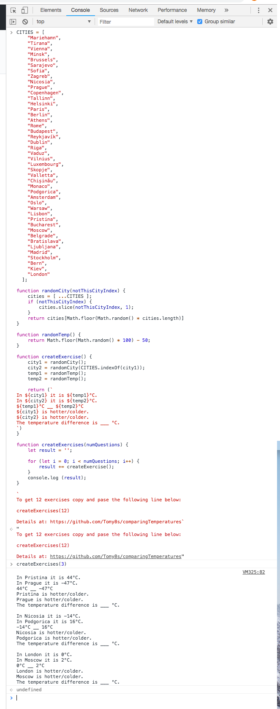

# Comparing Temperatures

Prints a simple exercise for practising comparisons of positive and negative temperatures (-50°C - +50°C) using real city names, however temperatures are not correlated to true temperatures in the given cities.

e.g.:


```
In Rome it is -30°C.
In Madrid it is 49°C.
-30°C __ 49°C
Rome is hotter/colder.
Madrid is hotter/colder.
The temperature difference is ___ °C.
```

## How to run it.

Copy the contents of [`index.js`](./index.js)

In Chrome, press `ctrl` + `shift` + `J` (`⌘` + `⌥` + `J` on Mac)

Paste the contents of the file into the box that apears and press `return`

Type `createSentences(<number of sentences>)` and press `return`

e.g. If you would like 3 sentences type `createExercises(3)` and press `return`


